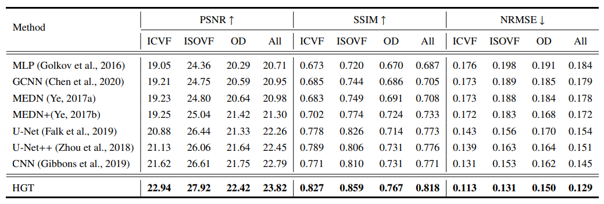

# Inferring Tissue Microstructure from Undersampled Diffusion MRI via a Hybrid Graph Transformer
##Brief
This is an implementation of **Inferring Tissue Microstructure from Undersampled Diffusion MRI via a Hybrid Graph Transformer** by **Pytorch**.

We jointly consider the information in both x-space and q-space with our HGT, overcoming the limitations of existing methods that are unable to make full use of joint x-q space information.

- We have performed extensive experiments on the [HCP](https://db.humanconnectome.org/) data to evaluate our HGT.
- We predicted typical microstructure models such as NODDI and DKI
- We uniformly select 30 gradients with b = 1000 s/$\text{mm}^{\text{2}}$ from the raw HCP data to simulate the undersampled DMRI data used as input to train our model.
- Another undersampling pattern is a two-shell case with 60 uniform gradients, i.e., 30 for b = 1000 s/$\text{mm}^{\text{2}}$, 30 for b = 2000 s/$\text{mm}^{\text{2}}$, which is recommended for typical microstructure models, such as NODDI.

## Model

The model is divided into two modules: q-space learning with a GNN and x-space learning with a Transformer. CRDT denotes Cascaded Residual Dense Transformer. TransLayer is short for the Transformer layer. SRA denotes spatial-reduction attention. Finally, after a linear layer, the expected microstructure estimations are obtained

## Results
We trained the network with an NVIDIA GeForce GTX 2080 GPU with 8GB RAM.

The results of prediction NODDI on 30 gradient directions on one shell are as follows.

The results of prediction DKI on 30 gradient directions on one shells are as follows.


## Usage
### Environment
```python
pip install -r requirement.txt
```
If you are installing in a linux environment, you can run the following actions.
```python
bash install.sh
```
###Pretrained Model
The parameters of the pre-trained model are the default parameters in the code.

| Tasks                                          | Platform                                                      | 
|------------------------------------------------|---------------------------------------------------------------|
| NODDI on 30 gradient directions on one shell   | [Baidu Yun](https://) / [Google Drive](https://)
| NODDI on 60 gradient directions on two shells  | [Baidu Yun](https://) / [Google Drive](https://) 
| DKI on 30 gradient directions on one shell     | [Baidu Yun](https://) / [Google Drive](https://)

```python
# Download the pretrain model and edit [use model]_config.py about "pretrained_flag" and "pretrained_weights" :
"train"="dict" (
       "pretrained_flag" = True,
       "pretrained_weights" = [your pretrain model path]
)
```
### Data Prepare
Using HGT requires protocol of data is same. If it is not consistent, you can remove the q-Space Learning Module, but the performance will deteriorate. At first, you should organize the images layout like this(Take HCP data as an example), this step can be finished by `prepare_data.py` automatically:

```shell 
data/
├── 100610
    ├── data.nii.gz # HCP data file
    ├── nodif_brain_mask.nii.gz # mask file(you can use dipy to generate)
    ├── bvec # b-value data file
    └── bval # b-value data direction file
├── 102311 
    ├── data.nii.gz
    ├── nodif_brain_mask.nii.gz
    ├── bvec
    └── bval
├── bvec 
└── bval
```

```python
python prepare_data.py  --path [dataset root]
```

###Training
```python
# To train the DKI model you only need to change the microstructure_name
python train.py --config './config/hgt_config.py' --microstructure_name 'NODDI'
```

### Test/Evaluation
```python
# To train the DKI model you only need to change the microstructure_name
# If you do not want to generate a prediction file just change --is_generate_image to False
python test.py --config './config/hgt_config.py' --microstructure_name 'NODDI' --is_generate_image True
```

## Acknowledge
This work was supported in part by the National Natural Science Foundation of China under Grant 62201465,
the Fundamental Research Funds for the Central Universities under Grant D5000220213,
the Natural Science Foundation of Heilongjiang Province under Grant LH2021F046, 
the National Natural Science Foundation of China under Grant 62171377, 
and the Key Research and Development Program of Shaanxi Province under Grant 2022GY-084. P.-T. Yap was supported in part by the United States National Institutes of Health (NIH) through grant MH125479

and we are benefiting a lot from the following projects:

- https://github.com/pyg-team/pytorch_geometric
- https://github.com/4uiiurz1/pytorch-nested-unet
- https://github.com/whai362/PVT